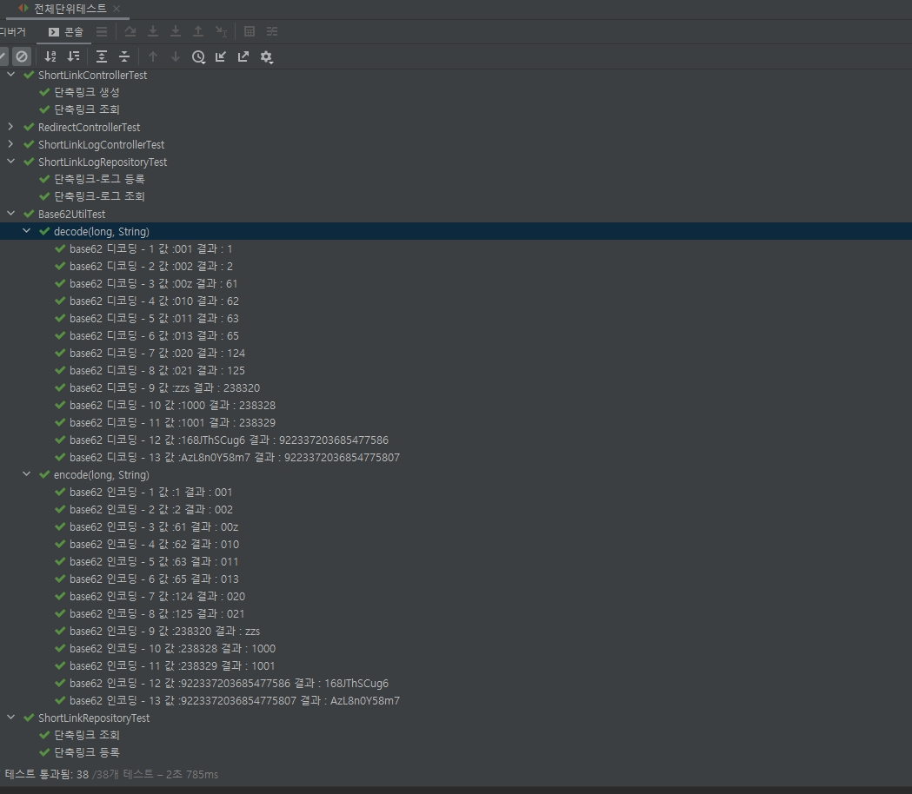

# short-link

## 스킬
* Java11
* Spring Boot
* JPA - ORM
* Hibernate
* Spring Data JPA
* H2 - 인메모리 db
* Bean Validation - 유효성검사
* Hateoas - endpoint resource화
* Mapstruct - type 형변환 compile단계
* Junit - 단위테스트
* Mockito - 목생성
* EhCache - 캐싱
* Swagger - apidocs
* Aspect - aop 기능사용(단축링크로그 카운터시)

## 엔티티

**SHORT_LINK**

|속성|타입|설명|
|---|---|---|
|shortLinkId| Long | autoincrement 이지만 base62 형태로 변환하기 위한 기준키값 |
|uri| String | 입력받은 uri |
|createdAt| LocalDateTime| 생성일시 |

**SHORT_LINK_LOG**

|속성|타입|설명|
|---|---|---|
|shortLinkId|Long| base62 형태로 변환하기 위한 기준키값 |
|logAt|타입| 로그 |
|count|long|설명|

## 기능확인

1. 단축링크 생성기능

* base62(0123456789ABCDEFGHIJKLMNOPQRSTUVWXYZabcdefghijklmnopqrstuvwxyz) 기준 단축 url 생성
* 최소 3자리 이상(alphanumeric) 문자열 생성 - db에서 auto increment 생성해서 base62 encoding 별도진행(최소 3자리 보장)
* 등록된 uri 존재시 해당 shortId 반환 및 캐싱처리

2. 단축링크 조회기능

* shortId, uri, 생성일시 반환
* 같은 shortId 요청시 트래픽처리를 위한 캐싱처리
* hateoas로 redirection uri 응닶갑에 포함

3. 단축링크 리다이렉션 기능

* 302 상태코드 반환 및 브라우저 이동
* 같은 shortId 요청시 트래픽처리를 위한 캐싱처리
* aop를 사용하여 조회카운터 로그저장 (redis 사용해야되지만 ehcache를 알아봣으나 응용방법이 제가 찾을때는 없다고 보이는데.. concurrentHashMap 사용해서 1분(과제라서 빨리확인하기위한 짧은 시간)마다 db 카운터 저장)
* 조회카운터 저장시 캐싱evit

4. 단축링크 클릭시 로그기능(리다이렉션 기준)

* shortId 기준으로 일자별 카운팅숫자 반환
* 같은 shortId 요청시 트래픽처리를 위한 캐싱처리

## 테스트확인

* 서비스단 빼고 확인

